# Adapti-Learn: Conceptual Architecture Diagram

## High-Level Overview

```mermaid
graph LR
    subgraph "Users"
        S[👤 Students]
        M[👨‍🏫 Mentors]
    end

    subgraph "Adapti-Learn Platform"
        FE[Frontend<br/>React + TypeScript]
        Services[Services Layer<br/>12 Core Services]
        AI[AI Engine<br/>Adaptive Learning]
    end

    subgraph "Data & External"
        DB[(Supabase<br/>Database)]
        Ext[External APIs<br/>YouTube, Jobs, AI]
    end

    S --> FE
    M --> FE
    FE --> Services
    Services --> AI
    Services --> DB
    Services --> Ext
    AI --> Services
```

## System Overview

## Key Components Breakdown

### 1. **User Roles**
- **Student**: Primary learner with access to learning materials, practice, and personalization
- **Mentor**: Educator who monitors student progress and provides guidance
- **Admin**: System administrator (future role)

### 2. **Core Student Features**
- **Dashboard**: Overview of progress, insights, recommendations, and activity heatmap
- **Learning Module**: Access to learning materials and resources
- **Practice & Quizzes**: AI-generated quizzes with adaptive difficulty
- **Study Notes**: Create, manage, and organize study notes
- **Timetable**: Schedule and manage study sessions
- **Podcasts**: Educational podcast content
- **Job Search**: Career opportunities and job listings
- **Competitive Exams**: Preparation materials for competitive exams
- **Profile & Settings**: User profile management

### 3. **Mentor Features**
- **Mentor Dashboard**: Overview of all students' performance
- **Student Management**: View and manage assigned students
- **Detailed Reports**: In-depth analysis of individual student performance
- **Analytics**: Class-wide insights and trends

### 4. **Services Architecture**

#### Authentication & Authorization
- Supabase Auth for user authentication
- Role-based access control (Student/Mentor)
- Protected routes implementation

#### Learning Services
- **Quiz Service**: Generates quizzes based on branch, semester, and subject
- **Quiz Results**: Tracks performance, calculates metrics, identifies weak areas
- **Personalized Recommendations**: AI-powered learning path suggestions
- **Activity Tracker**: Monitors learning activity and streaks

#### Content Services
- **Study Notes**: CRUD operations for study notes with AI generation
- **Timetable**: Session scheduling and management
- **YouTube Integration**: Video recommendations for learning topics
- **Job Search**: Career opportunity search and filtering

#### AI Services
- **Chatbot**: Educational assistant using OpenRouter API
- **Gemini Integration**: AI text generation and analysis
- **Adaptive Algorithm**: Elo-style difficulty adjustment
- **Gap Detection**: Identifies learning weaknesses

### 5. **Data Storage**
- **Supabase (PostgreSQL)**: Primary database for user data, profiles, timetables, quiz results
- **Local Storage**: Client-side caching for quiz results, activity tracking, study notes

### 6. **External Integrations**
- **OpenRouter API**: LLM provider for chatbot and AI features
- **YouTube API**: Video content for learning
- **Job Search APIs**: Career opportunities

## Data Flow

## Technology Stack

### Frontend
- **React 18** with TypeScript
- **Vite** for build tooling
- **React Router** for navigation
- **shadcn-ui** + **Tailwind CSS** for UI components
- **TanStack Query** for data fetching
- **Recharts** for data visualization

### Backend & Database
- **Supabase** (PostgreSQL) for database and authentication
- **Supabase Auth** for user management

### AI & External Services
- **OpenRouter API** (Meta Llama 3.3 70B) for AI features
- **YouTube API** for video content
- **Job Search APIs** for career opportunities

### Key Libraries
- **React Hook Form** + **Zod** for form validation
- **date-fns** for date manipulation
- **Lucide React** for icons

## Adaptive Learning Features

1. **Real-Time Difficulty Adjustment**: Elo-style algorithm adjusts quiz difficulty based on performance
2. **Learning Gap Detection**: Identifies weak concepts and topics
3. **Personalized Recommendations**: AI-generated study plans and content suggestions
4. **Performance Analytics**: Comprehensive metrics and progress tracking
5. **Activity Tracking**: Streaks, heatmaps, and engagement monitoring
6. **Mentor Insights**: Detailed reports for educators to track student progress

## Security & Access Control

- Role-based authentication (Student/Mentor)
- Protected routes with `ProtectedRoute` component
- Supabase Row Level Security (RLS) policies
- Secure API key management via environment variables

