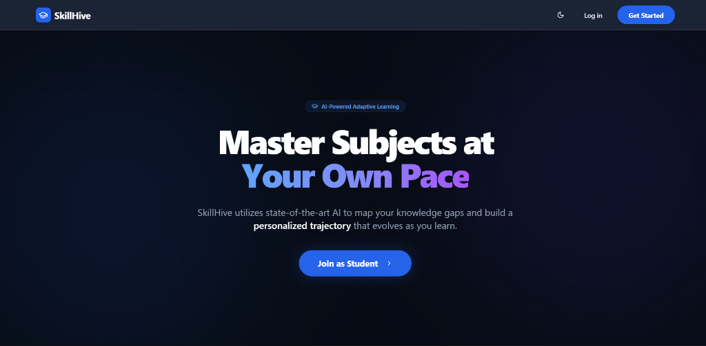

# SkillHive: AI-Powered Adaptive Learning & Career Assistant

SkillHive is an intelligent learning platform that adapts to each student's pace, identifies learning gaps, and provides personalized recommendations using AI. It combines dynamic quiz generation, adaptive practice, explainable resume analysis, and a focused learning environment.

## Key Features

### Adaptive Learning
- **Dynamic Quizzes**: AI-generated questions (MCQs) powered by Google Gemini, tailored to specific concepts.
- **Weak Area Detection**: Automatically identifies struggle areas and tags concepts for review.
- **Personalized Recommendations**: YouTube video suggestions based on performance and learning gaps.

### Career Assistance
- **Smart Resume Analysis**: Upload a resume (PDF) or fill out a profile to get instant AI feedback on strengths and improvements.
- **Job Matching**: Intelligent job search that matches your skills and experience to relevant opportunities.
- **Explained Matches**: Detailed reasoning for why a job is a good fit and what skills might be missing.

### Learning Tools
- **Podcast Mode**: Convert educational YouTube videos into audio-only podcasts for on-the-go learning and also has podcasts on general topics(requires `yt-dlp`).
- **Interactive Timetable**: Manage classes and study sessions.
- **Support & Focus**: Integrated support system and goal tracking.

### Architecture
- **Frontend**: React, Vite, TypeScript, Tailwind CSS, Shadcn UI.
- **Backend/Services**: 
  - **Audio Server**: Node.js Express server for YouTube audio extraction.
  - **AI Integration**: Google Gemini (via API) for reasoning and content generation.
  - **Database**: Supabase for user profiles, progress tracking, and authentication.

---

## Getting Started

**For complete installation and usage instructions, please read [SETUP.md](./SETUP.md).**

The setup guide covers:
- Prerequisites (Node.js, Supabase, yt-dlp).
- detailed Environment Variable configuration.
- How to run the Development Server and Audio Backend.

---

## License

Distributed under the MIT License. See `LICENSE` for more information.
